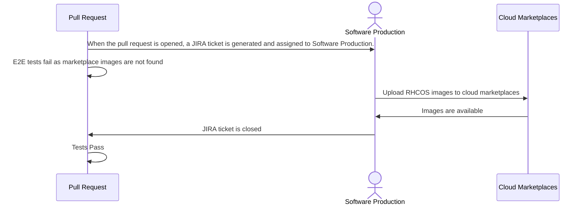

# RHCOS Cloud-Marketplace Images

## Summary

This enhancement proposes a process to upload/publish
cloud (AWS, Azure, & GCP) marketplace images and include
the image details in the RHCOS stream.

## Motivation

Publishing marketplace versions in the RHCOS stream will
improve user experience and relieve tech debt:

* Marketplace images published as part of Project Stratosphere are incomplete, requiring users to use
boot images from previous releases, which slows
down machine provisioning.
* As marketplace images are not included in the coreos
stream, users must manually enter the image details.
With these changes, the experience will be improved
so that users can simply indicate they want to use
marketplace images and the installer will select the
appropriate image.
* Publishing a free Azure marketplace image would
significantly decrease Azure installation times &
would unblock Azure hosted control planes. On Azure, marketplace
images are the only globally available, production-ready API for
publishing images. Currently, every install creates a managed image
utilizing the 16GB VHD file found in the RHCOS stream. Publishing
an image would immediately save time during installs, reduce
installer code maintenance, and reduce cluster cost.

### User Stories

* As an OpenShift cluster admin, I want to specify
a boolean value for marketplace images in the install
config so that I can utilize marketplace images without
looking up specific version numbers.

### Goals

* A well-defined process for publishing cloud marketplace
images and including them in the RHCOS stream.
* Setup non-paid Azure marketplace offering: determine publisher
* Definition in RHCOS stream to separate multiple similar offers (e.g. ROSA-specific marketplace images vs.
OpenShift AWS marketplace images, Azure paid vs. free images)

### Non-Goals

TBD

## Proposal

This enhancement proposes a process for publishing the images and
a specification for how the images would be published in the stream.

The process for uploading images will be based on RHCOS stream bump
PRs. New PRs to the installer will trigger a request to upload images.
When the images are available, the PR will be merged to update the stream.

Marketplace images will be included in the
`.architectures[("aarch64","x86_64")].rhel_coreos_extensions` fields. 


### Workflow Description

The workflow for uploading cloud marketplace images is a
pull-request-based workflow; the uploading of marketplace
images will be initiated by a pull request bumping the RHCOS
stream in the installer.

**pull request** is a pull request, opened by an RHCOS engineer,
bumping the RHCOS stream in openshift/installer. The bump
is based 

**software production** is the team of engineers who perform
the marketplace image uploads.

**cloud marketplaces** are AWS, Azure & GCP.



### API Extensions

Machine pools in the install config would be updated to allow users to more simply
opt in to using marketplace images without specifying particular image details.

#### Azure

Currently in Azure, to use paid marketplace images, [users consult
documentation to determine image details](https://docs.openshift.com/container-platform/4.16/installing/installing_azure/installing-azure-customizations.html#installation-azure-marketplace-subscribe_installing-azure-customizations)
and enter image details in the install config like this:

```yaml
compute:
- name: worker
  platform:
    azure:
      osImage:
        publisher: RedHat
        offer: rh-ocp-worker
        sku: rh-ocp-worker
        version: 413.92.2023101700
```

A `marketplaceImage` field would be added (OPEN QUESTION: either as a child of `osImage` or as a sibling)
with the following enum values:

* `NoPurchasePlan` - equivalent to a standard Azure OpenShift install, except under the
hood we switch the use of the managed image with a non-paid OpenShift image
* `PurchasePlanNorthAmerica` - equivalent to the yaml snippet directly preceding this
* `PurchasePlanEMEA` - for users in EMEA, selects marketplace images from the `redhat-limited` publisher

See implementation details below for how these install config values would be translated into selecting
images from the RHCOS stream.

#### AWS

TODO

#### GCP

TODO

### Topology Considerations

#### Hypershift / Hosted Control Planes

ROSA and ARO both make use of marketplace images. ARO HCP depend on the
availability of Azure marketplace images. It is an Open Question as to whether
ARO requires a set of Azure marketplace images that is distinct from typical
Azure OpenShift images.

#### Standalone Clusters

Standalone Azure clusters will have a faster installation time as they will no
longer be required to upload a VHD with which to create a managed image.

#### Single-node Deployments or MicroShift

N/A

### Implementation Details/Notes/Constraints

#### RHCOS Stream

The RHCOS stream, [a json file in the installer repo](https://github.com/openshift/installer/blob/master/data/data/coreos/rhcos.json), is the source
of truth `openshift-install` uses to select & specify versioned first-boot images
when provisioning machines. The stream contains a top-level `.architectures`
object and each architecture contains:

* `artifacts`: platform-specific details regarding the source artifact, such
as file format, file location, SHA, etc.
* `images`: details about images in specific cloud platforms, particularly
region to image mappings
* `rhel-coreos-extensions` (optional): is an extensible object, where the
only current value is `azure-disk`

#### Azure

In Azure, OpenShift currently publishes *paid* marketplace images
(which are not published in the RHCOS stream). So we need to add an
additional free marketplace image, as well as publishing those in
the stream.

##### Azure Marketplace Images

Using the [commands from our docs](https://docs.openshift.com/container-platform/4.16/installing/installing_azure/installing-azure-customizations.html#installation-azure-marketplace-subscribe_installing-azure-customizations), we can see the current marketplace images:

```shell
$  az vm image list --all --offer rh-ocp-worker --publisher redhat -o table
Architecture    Offer          Publisher       Sku                 Urn                                                                Version
--------------  -------------  --------------  ------------------  -----------------------------------------------------------------  -----------------
x64             rh-ocp-worker  RedHat          rh-ocp-worker       RedHat:rh-ocp-worker:rh-ocp-worker:4.8.2021122100                  4.8.2021122100
x64             rh-ocp-worker  RedHat          rh-ocp-worker       RedHat:rh-ocp-worker:rh-ocp-worker:413.92.2023101700               413.92.2023101700
x64             rh-ocp-worker  redhat-limited  rh-ocp-worker       redhat-limited:rh-ocp-worker:rh-ocp-worker:4.8.2021122100          4.8.2021122100
x64             rh-ocp-worker  redhat-limited  rh-ocp-worker       redhat-limited:rh-ocp-worker:rh-ocp-worker:413.92.2023101700       413.92.2023101700
x64             rh-ocp-worker  RedHat          rh-ocp-worker-gen1  RedHat:rh-ocp-worker:rh-ocp-worker-gen1:4.8.2021122100             4.8.2021122100
x64             rh-ocp-worker  RedHat          rh-ocp-worker-gen1  RedHat:rh-ocp-worker:rh-ocp-worker-gen1:413.92.2023101700          413.92.2023101700
x64             rh-ocp-worker  redhat-rhel     rh-ocp-worker       redhat-rhel:rh-ocp-worker:rh-ocp-worker:4.13.2023101100            4.13.2023101100
x64             rh-ocp-worker  redhat-limited  rh-ocp-worker-gen1  redhat-limited:rh-ocp-worker:rh-ocp-worker-gen1:4.8.2021122100     4.8.2021122100
x64             rh-ocp-worker  redhat-limited  rh-ocp-worker-gen1  redhat-limited:rh-ocp-worker:rh-ocp-worker-gen1:413.92.2023101700  413.92.2023101700
x64             rh-ocp-worker  redhat-rhel     rh-ocp-worker-gen1  redhat-rhel:rh-ocp-worker:rh-ocp-worker-gen1:4.13.2023101100       4.13.2023101100
```

Images from the `redhat-limited` publisher are for EMEA while `RedHat` is for North America. Free marketplace images could be published under
a new offer, such as: `RHCOS`, `OpenShift` or, keeping in line with the current convention, `rh-ocp`, such that the listing would look like:

```shell
$  az vm image list --all --offer rhcos --publisher redhat -o table
Architecture    Offer          Publisher       Sku                 Urn                                          Version
--------------  -------------  --------------  ------------------  -------------------------------------------  -----------------
x64             rhcos          RedHat          rhcos               RedHat:rhcos:rhcos:417.94.202407010929       417.94.202407010929
x64             rhcos          RedHat          rhcos-gen1          RedHat:rhcos:rhcos-gen1:417.94.202407010929  417.94.202407010929
```

##### Azure Stream Representation

An Azure Marketplace extension, `azure-marketplace`, would be added, with unpaid and paid (both North America & EMEA)
marketplace images listed as child objects: 

```yaml
"rhel-coreos-extensions": {
  "azure-disk": {
    "release": "417.94.202407010929-0",
    "url": "https://rhcos.blob.core.windows.net/imagebucket/rhcos-417.94.202407010929-0-azure.x86_64.vhd"
  },
  "azure-marketplace": {
    "no-purchase-plan": {
      "publisher": "RedHat",
      "offer": "rhcos",
      "sku": "rhcos",
      "version": "417.94.202407010929"
    },
    "purchase-plan-north-america": {
      "publisher": "RedHat",
      "offer": "rh-ocp-worker",
      "sku": "rh-ocp-worker",
      "version": "417.94.202407010929"
    },
    "purchase-plan-emea": {
      "publisher": "redhat-limited",
      "offer": "rh-ocp-worker",
      "sku": "rh-ocp-worker",
      "version": "417.94.202407010929"
    }
  }
```

[Hyperv Generation 1 images](https://learn.microsoft.com/en-us/azure/virtual-machines/generation-2#features-and-capabilities)
would be published, identified by a `gen1` suffix, but would not be included in the RHCOS stream. Any time that the installer
or users need to select a gen1 image, they would simply add the `gen1` suffix to the SKU identified in the RHCOS stream.  

OPEN QUESTION: How to handle EMEA vs North America 
OPEN QUESTION: how to handle azure gen1 image

#### AWS

TODO 
- AWS marketplace images are region-specific. Does it also make sense to include them in the extension?

#### GCP

TODO

### Risks and Mitigations

TODO

### Drawbacks

TODO

## Open Questions [optional]

TODO

## Test Plan

TODO

## Graduation Criteria

TODO

### Dev Preview -> Tech Preview

TODO

### Tech Preview -> GA

TODO

### Removing a deprecated feature

N/A

## Upgrade / Downgrade Strategy

TODO

## Version Skew Strategy

TODO

## Operational Aspects of API Extensions

TODO

## Support Procedures

TODO

## Alternatives

Investigate installers ability to search marketplace for latest images, and whether this is a viable alternative.

## Infrastructure Needed [optional]

TODO